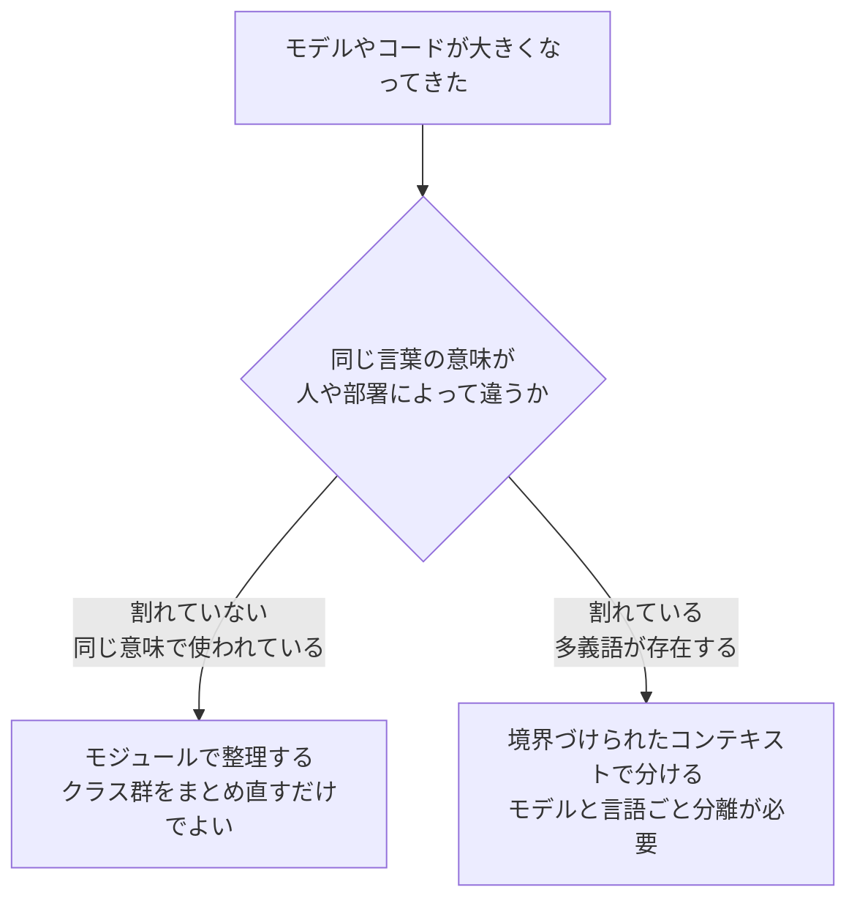

# モジュールと境界づけられたコンテキストの使い分け

関連：[第09章_用語集「境界づけられたコンテキストとモジュールの違い」](../第09章_用語集.md#境界づけられたコンテキストとモジュールの違い)、[B_ドメイン分割とコンテキスト設計 B-02](../../問題集/B_ドメイン分割とコンテキスト設計.md)、[B-07](../../問題集/B_ドメイン分割とコンテキスト設計.md)、[E4_モジュール E4-06](../../問題集/E4_モジュール.md)、[E4-07](../../問題集/E4_モジュール.md)

## なぜ混同しやすいか

「モジュール」も「境界づけられたコンテキスト（BC）」も、どちらも**モデルを分割する**ための仕組みという点では似て見える。しかし、両者は「何を解決するための分割か」がまったく違う。この違いを取り違えると、クラスを整理すればよいだけの場面でBCを切ってしまい（過剰な分割）、逆に言葉の意味が割れている場面をモジュールの整理で済ませてしまう（不十分な分割）。

## 対比表

| 観点 | モジュール | 境界づけられたコンテキスト（BC） |
|---|---|---|
| 性質 | プログラミング的な仕組み（Java の `package`、C# の `namespace`） | ユビキタス言語の境界線（ビジネス的な境界線） |
| 分割する理由 | クラスが増えて見通しが悪い（整理整頓の問題） | 同じ言葉の意味が人・部署によって違う（言語の衝突の問題） |
| 言葉の意味 | 関係者全員で統一されている | 統一されていない（多義語が存在する） |
| 規模 | 小〜中：クラス群のまとまり | 大：独立したチーム・デプロイ単位になる可能性 |
| 解決すること | コードの責任整理・凝集度の向上 | モデルの一貫性の確保・会話のズレの防止 |

## 判断基準：言葉の意味が割れているか

分類の決め手は一つだけ。**その場面で、ユビキタス言語（言葉の意味）が割れているかどうか**である。

言葉が割れていなければ、単にクラスの見通しが悪いだけなので、パッケージ構成を見直す（モジュール）で十分。言葉が割れていれば、クラス構成をいくら整理してもモデルの矛盾は解決しないため、BCとして分離しモデルと言語を分ける必要がある。

## シナリオで確認する

| 状況 | 言葉の意味 | 分割の仕方 |
|---|---|---|
| 「プロダクト」パッケージのクラスが増えて見通しが悪いが、関係者はみな同じ言葉を同じ意味で使っている | 割れていない | モジュール |
| ドメイン層のクラスを、扱う概念ごとに整理して見つけやすくしたい | 割れていない | モジュール |
| 「顧客」という言葉を、営業担当は見込み客を含む意味で、経理担当は請求先の意味で使っている | 割れている | BC |
| 部門ごとに同じ用語の定義が違い、ドメインエキスパート同士の会話がかみ合わない | 割れている | BC |

左の2つは「コードの量・見通し」の問題であり、言葉自体は共通しているため、モジュールで分けて整理すれば解決する。右の2つは「言葉の意味そのもの」が人によって異なっており、モジュールでいくらクラスを整理しても会話のズレは解消されないため、BCとしてモデルごと分離する必要がある。

## 分割の時機

この判断は「最初の設計時にあらかじめ分割しておく」ものではない。教材は次の方針を示している。

- **最初の設計時**：モデルがまだ小さいうちは、無理に分割せず、ひとまとめのままにするほうが無難な場合もある
- **分割を検討するとき**：モデルが大きくなってきたときに、ドメインエキスパートの言葉に従って、モジュールとBCのどちらによる分割が最適かを検討する

つまり「将来に備えて最初から細かく分割しておく」のは教材の考え方に沿わない。分割の検討は、モデルが実際に大きくなった時点で、ドメインエキスパートの言葉（ユビキタス言語が割れているかどうか）を観察してから行う。

## 根拠

- 第09章まとめ「境界づけられたコンテキストとモジュールの使い分け」
- 第09章_用語集「境界づけられたコンテキストとモジュールの違い」
- 問題集 B-02（BCの定義と原則）、B-07（ドメインとBCの関係）
- 問題集 E4-06（分割先の分類）、E4-07（分割の時期と従う対象）
